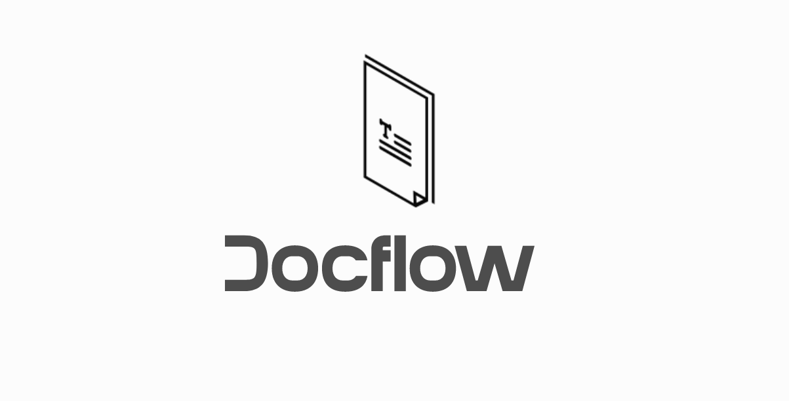

# Docflow
:pencil: Lightweight documentation generator designed for simplicity and efficiency



## Features

- Generate documentation from user code in two selectable formats: code docstring and Markdown.
- Simple and intuitive interface for ease of use.
- Integration with AI model (Anthropic, Google, OpenAI) for enhanced processing capabilities.
- Customizable output format.
- Lightweight and efficient, minimizing overhead.
- Supports multiple programming languages.


## Getting Started

### 1. Clone the repository

```bash
git clone https://github.com/miguelcsx/docflow.git
```
### 2. Install the required dependencies

```bash
pip install -r requirements.txt
```

### 3. Run the application

```bash
reflex init
reflex run
```

## Contributing

Contributions are welcome! Feel free to open an issue or submit a pull request if you have any suggestions or improvements.

## License

This project is licensed under the MIT License - see the [LICENSE](LICENSE) file for details.
